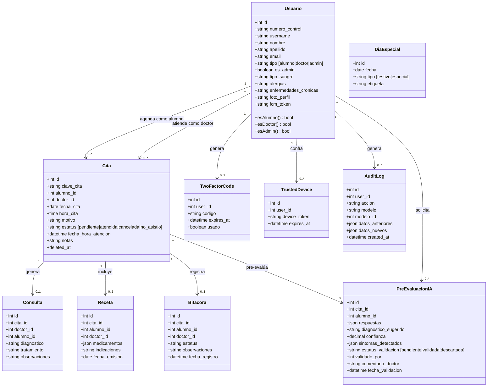
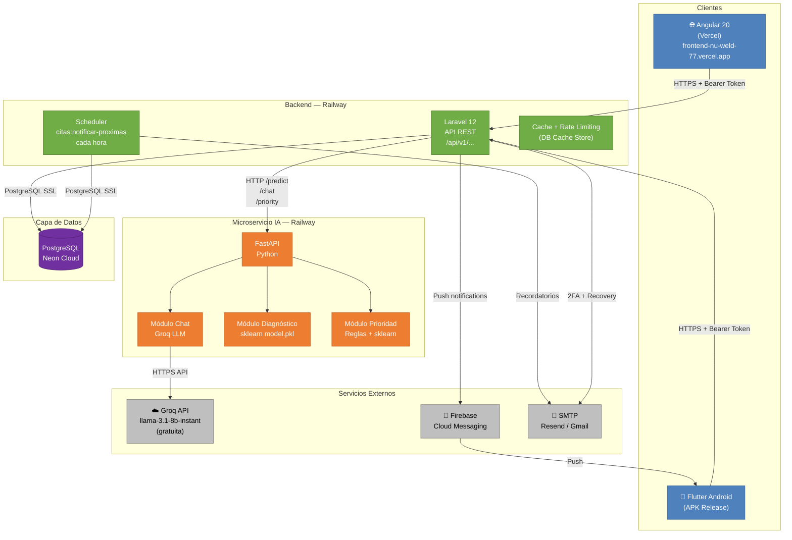

# Entregable del Sistema — Yoltec
**Sistema de Gestión de Consultorio Médico Universitario con IA**

---

## 1. Descripción Detallada del Sistema

**Yoltec** es una plataforma integral de gestión para el consultorio médico de una institución universitaria. Permite a alumnos agendar citas médicas, recibir una pre-evaluación de síntomas asistida por inteligencia artificial y consultar su historial clínico. Los doctores gestionan su agenda, atienden consultas, crean recetas digitales, y cuentan con herramientas de IA para priorizar la atención. El personal administrativo gestiona el catálogo de usuarios y el calendario institucional.

### 1.1 Actores del sistema

| Actor | Descripción |
|-------|-------------|
| **Alumno** | Paciente universitario. Agenda citas, realiza pre-evaluaciones de síntomas, consulta su historial y recetas. |
| **Doctor** | Médico del consultorio. Gestiona su agenda, llena formularios de consulta, crea recetas, valida diagnósticos de IA y clasifica prioridades. |
| **Administrador** | Gestiona el catálogo de alumnos y doctores, y configura el calendario de días especiales/festivos. |

### 1.2 Módulos principales

| Módulo | Descripción |
|--------|-------------|
| **Autenticación y autorización** | Login por rol. Alumnos: número de control + NIP. Doctores: usuario + contraseña + 2FA por email (producción). Admin: usuario + contraseña. Tokens Sanctum. Recuperación de contraseña por email. |
| **Gestión de citas** | Calendario interactivo con slots de 15 minutos, Lunes–Sábado, 8:00–17:00. Disponibilidad visual (verde/amarillo/rojo). Días festivos configurables por admin. Alumno y doctor pueden agendar/cancelar. |
| **Dashboard del doctor** | Vista de citas del día, próxima cita, estadísticas mensuales (Chart.js), distribución por estado. |
| **Formulario de consulta** | Doctor llena diagnóstico, tratamiento y observaciones al atender. Los datos quedan ligados a la cita. |
| **Recetas médicas** | Doctor crea recetas digitales con medicamentos, dosis y frecuencia. Alumno las consulta en web y app móvil. |
| **Bitácora / Historial** | Registro completo de citas atendidas, canceladas y no asistidas. Filtros por fecha y alumno, paginación, exportación CSV. |
| **Pre-evaluación de síntomas (IA)** | Chat en lenguaje natural con Groq LLM + diagnóstico diferencial con porcentaje de confianza mediante modelo sklearn. Doctor puede validar o descartar. |
| **Clasificación de prioridad (IA)** | Clasifica alumnos en alta/baja prioridad según historial de asistencia. Solo visible para el doctor. |
| **Perfil médico del alumno** | Tipo de sangre, alergias, enfermedades crónicas. Editable por el alumno; visible para el doctor. |
| **Panel de administración** | CRUD de alumnos y doctores. Configuración de días especiales en el calendario. |
| **Notificaciones** | Email automático de recordatorio 24h antes de la cita. Notificaciones push via Firebase Cloud Messaging (FCM) en la app móvil. |
| **App móvil** | Aplicación Flutter para Android con funcionalidad completa: citas, IA, bitácora, recetas, perfil. |

---

## 2. Requerimientos Funcionales

| ID | Requerimiento |
|----|---------------|
| **RF-01** | El sistema debe permitir el inicio de sesión diferenciado por rol (alumno, doctor, administrador). |
| **RF-02** | El sistema debe enviar un código de verificación por email al doctor en producción antes de permitir el acceso (2FA). |
| **RF-03** | El alumno debe poder agendar una cita seleccionando fecha, hora disponible y motivo de consulta. |
| **RF-04** | El sistema debe mostrar visualmente la disponibilidad de slots en el calendario con código de colores. |
| **RF-05** | El sistema debe impedir que dos alumnos reserven el mismo slot horario con el mismo doctor. |
| **RF-06** | El alumno y el doctor deben poder cancelar una cita. Al cancelar, el slot debe liberarse automáticamente. |
| **RF-07** | El sistema debe inhabilitar automáticamente los domingos y los días especiales configurados por el administrador. |
| **RF-08** | El doctor debe poder visualizar todas las citas del día actual y la próxima cita pendiente. |
| **RF-09** | El doctor debe poder registrar diagnóstico, tratamiento y observaciones para cada cita atendida. |
| **RF-10** | El doctor debe poder crear una receta médica digital con uno o varios medicamentos, dosis e indicaciones. |
| **RF-11** | El alumno debe poder consultar sus recetas médicas desde la web y la app móvil. |
| **RF-12** | El sistema debe registrar automáticamente en la bitácora el resultado de cada cita (atendida, cancelada, no asistió). |
| **RF-13** | El doctor y el alumno deben poder filtrar la bitácora por fecha. El doctor también puede filtrar por alumno. |
| **RF-14** | El usuario debe poder exportar su bitácora en formato CSV. |
| **RF-15** | El alumno debe poder iniciar una pre-evaluación de síntomas mediante un chat en lenguaje natural. |
| **RF-16** | El sistema de IA debe responder con un diagnóstico diferencial y porcentaje de confianza usando un modelo entrenado. |
| **RF-17** | El doctor debe poder validar o descartar un diagnóstico sugerido por la IA. |
| **RF-18** | El sistema debe clasificar automáticamente a los alumnos en alta o baja prioridad según su historial de asistencia. |
| **RF-19** | El administrador debe poder crear, editar y eliminar usuarios (alumnos y doctores). |
| **RF-20** | El administrador debe poder agregar días especiales (festivos/inhabilitados) al calendario del sistema. |
| **RF-21** | El sistema debe enviar un correo electrónico de recordatorio 24 horas antes de cada cita programada. |
| **RF-22** | El sistema debe enviar notificaciones push al dispositivo móvil del alumno para confirmaciones y recordatorios. |
| **RF-23** | El alumno debe poder recuperar el acceso a su cuenta mediante un enlace enviado a su correo. |
| **RF-24** | El alumno debe poder registrar y actualizar su perfil médico (tipo de sangre, alergias, enfermedades crónicas). |
| **RF-25** | El sistema debe estar disponible en una aplicación móvil Android con las mismas funcionalidades principales que la versión web. |

---

## 3. Requerimientos No Funcionales

| ID | Requerimiento |
|----|---------------|
| **RNF-01** | **Seguridad:** Las contraseñas deben almacenarse con hash bcrypt (12 rondas). La comunicación debe ser exclusivamente por HTTPS en producción. Los tokens de autenticación deben ser de tipo Bearer (Laravel Sanctum). |
| **RNF-02** | **Disponibilidad:** El sistema debe tener una disponibilidad mínima del 99% mensual, soportada por la infraestructura en la nube (Railway + Vercel + Neon). |
| **RNF-03** | **Rendimiento:** Los endpoints de listado de citas y bitácora deben responder en menos de 500ms bajo carga normal. Las consultas frecuentes deben apoyarse en caché para reducir carga a la base de datos. |
| **RNF-04** | **Usabilidad:** La interfaz debe ser responsive. Debe soportar modo oscuro y modo claro en todos los componentes. La app móvil debe ser usable sin instrucciones previas por un alumno universitario. |
| **RNF-05** | **Mantenibilidad:** El sistema debe seguir una arquitectura por capas (controladores, modelos, servicios). Los módulos de IA, backend y frontend deben ser independientes y desplegables por separado. |
| **RNF-06** | **Portabilidad:** La aplicación web debe funcionar en los navegadores modernos principales (Chrome, Firefox, Edge). La app móvil debe ejecutarse en Android 8.0 o superior. |
| **RNF-07** | **Costo de operación:** El costo de infraestructura debe ser cero para el nivel de uso esperado, usando exclusivamente servicios con tier gratuito (Neon, Railway, Vercel, Groq API). |
| **RNF-08** | **Integridad de datos:** Las operaciones críticas (agendar/cancelar citas) deben ser atómicas. La base de datos debe garantizar integridad referencial mediante llaves foráneas. Las citas canceladas deben usar soft-deletes para mantener trazabilidad. |

---

## 4. Diagrama de Modelo de Dominio

---

## 5. Diagrama de Arquitectura Conceptual

### 5.1 Descripción de componentes

| Componente | Tecnología | Hosting | Responsabilidad |
|-----------|------------|---------|-----------------|
| **Frontend Web** | Angular 20 | Vercel | SPA de interfaz de usuario. Consume la API REST del backend. |
| **App Móvil** | Flutter (Android) | GitHub Releases APK | Cliente nativo Android. Misma API REST que el frontend web. |
| **Backend (API REST)** | Laravel 12 (PHP) | Railway | Lógica de negocio, autenticación, manejo de citas, recetas, bitácora. Expone endpoints REST protegidos por Sanctum. |
| **Scheduler** | Laravel Scheduler | Railway (mismo proceso) | Ejecuta cada hora el job de recordatorios de citas próximas. |
| **Microservicio IA** | FastAPI (Python) | Railway | Expone endpoints para chat de síntomas (Groq), diagnóstico diferencial (sklearn) y clasificación de prioridad. |
| **Base de datos** | PostgreSQL | Neon (cloud) | Almacén principal. Compartido entre ambiente de desarrollo y producción. |
| **Groq API** | LLM externo | Cloud (gratuito) | Generación de lenguaje natural para el chat de síntomas. Modelo: llama-3.1-8b-instant. |
| **Firebase FCM** | Servicio Google | Cloud | Envío de notificaciones push a la app móvil. |
| **SMTP (Resend/Gmail)** | Email | Cloud | Envío de 2FA, recordatorios y recuperación de contraseña. |

### 5.2 Flujos principales

**Agendar cita:**
> Alumno (Web/Móvil) → `GET /api/v1/citas/disponibilidad?fecha=&doctor_id=` → Backend consulta slots ocupados en DB → devuelve slots disponibles → Alumno selecciona slot + motivo → `POST /api/v1/citas` → Backend guarda en DB → responde 201 Created.

**Pre-evaluación de síntomas (IA):**
> Alumno escribe mensaje → `POST /api/v1/ia/chat` → Backend reenvía al microservicio IA (`/chat`) → FastAPI llama Groq API + modelo sklearn → devuelve respuesta + diagnóstico + confianza → Backend guarda `PreEvaluacionIA` en DB → responde al cliente.

**Recordatorio 24h:**
> Scheduler (cada hora) → `citas:notificar-proximas` → Backend busca citas en las próximas 24h sin notificación enviada → llama SMTP → envía email → marca notificación como enviada.

---

## 6. Repositorio

**GitHub:** https://github.com/elnemito001/Yoltec.git

